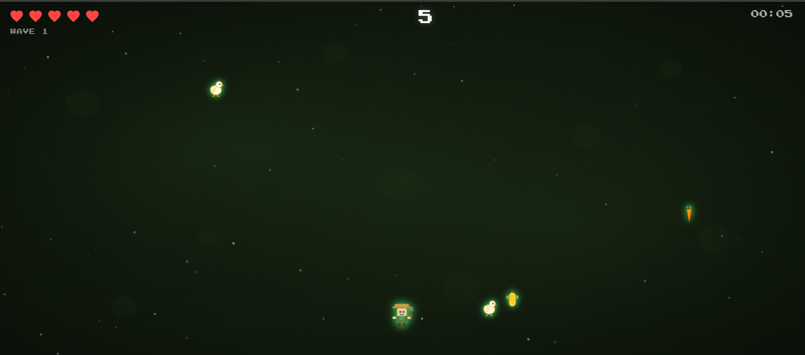

# Dangerous Harvest

> **Theme:** "Nothing is Safe"
> **Tech:** Vanilla JavaScript, HTML5 Canvas, CSS3
> **Team:** Le Fermier
> **Event:** Game Jam 2026

---

## About

**Dangerous Harvest** is a survival arcade game where you play as a farmer collecting items in a dark field. But **nothing is safe** — friendly crops, animals, and eggs **mutate into hostile threats** after a few seconds. Collect safe items for points while dodging the dangerous ones that chase you down.

The core mechanic revolves around the theme: every item starts as a helpful collectible, then turns into a deadly enemy. The longer you survive, the faster and more chaotic things get.

---

## Screenshots

### Menu


### Gameplay


---

## How to Play

### Controls

| Key | Action |
|-----|--------|
| `W` / `Z` / `Arrow Up` | Move up |
| `S` / `Arrow Down` | Move down |
| `A` / `Q` / `Arrow Left` | Move left |
| `D` / `Arrow Right` | Move right |

### Rules

1. **Green items** (carrot, corn, tomato, chicken, egg) are **safe** — walk into them to collect +10 points
2. After a few seconds, items **flash yellow** — this is the mutation warning
3. Items then turn **red and hostile** — they actively chase the player
4. Contact with a dangerous item = **lose 1 life** (5 lives total)
5. When all lives are lost = **Game Over**
6. Every **30 seconds**, a new **Wave** starts — spawn rate increases, mutation delay decreases, enemies get faster
7. Random **"NOTHING IS SAFE"** events can trigger — ALL items on screen instantly turn hostile

### Scoring

- **+10 points** per safe item collected
- **+1 point per second** survived
- Score is saved to the **Leaderboard** with your name

---

## Project Structure

```
Dangerous-jam-js/
├── index.html                    # Menu page (entry point)
├── README.md                     # This file
│
├── assets/
│   └── img/
│       ├── logo.svg              # Game logo (SVG)
│       ├── farmer.svg            # Player sprite
│       ├── field-bg.svg          # Game background
│       ├── carrot-safe.svg       # Carrot (safe version)
│       ├── carrot-danger.svg     # Carrot (mutated version)
│       ├── corn-safe.svg         # Corn (safe)
│       ├── corn-danger.svg       # Corn (mutated)
│       ├── tomato-safe.svg       # Tomato (safe)
│       ├── tomato-danger.svg     # Tomato (mutated/bomb)
│       ├── chicken-safe.svg      # Chicken (safe)
│       ├── chicken-danger.svg    # Chicken (mutated/demon)
│       ├── egg-safe.svg          # Egg (safe)
│       └── egg-danger.svg        # Egg (mutated/fire)
│
├── css/
│   ├── style.css                 # Menu page styles
│   └── game.css                  # Game page styles (HUD, overlays, leaderboard)
│
├── html/
│   └── game.html                 # Game page (canvas + HUD + game over)
│
└── js/
    ├── menu.js                   # Menu navigation, modals, leaderboard display
    └── game.js                   # Full game engine (rendering, physics, state)
```

---

## Features

### Gameplay
- **Progressive wave system** — difficulty increases every 30 seconds
- **Item state machine** — entering → safe → warning → dangerous
- **"Nothing is Safe" event** — random chaos moment where all items mutate at once
- **5 lives** with invincibility frames after taking damage
- **AABB collision detection** between player and items

### Visual Effects
- **Screen shake** on damage
- **Particle system** — green burst on collect, red burst on hit
- **Glow effects** — green for safe, yellow flash for warning, red for dangerous
- **Rotating sprites** for dangerous items
- **Animated background** with drifting star particles

### Persistence
- **Leaderboard** — top 10 scores saved in `localStorage`
- **Best score** tracking
- **Player name** remembered between sessions

### UI/UX
- **Responsive canvas** — adapts to any screen size
- **HUD** — hearts, score, time, wave indicator
- **Wave announcements** with pop-in animation
- **Game over screen** with name input and inline leaderboard
- **Menu** with Play, Rules, and Leaderboard modals

---

## Technical Stack

| Technology | Usage |
|------------|-------|
| **HTML5** | Page structure, Canvas element, semantic markup |
| **CSS3** | Flexbox/Grid layout, animations, gradients, `clip-path`, `backdrop-filter` |
| **JavaScript (ES6+)** | Game loop (`requestAnimationFrame`), DOM manipulation, `localStorage`, Promises |
| **SVG** | All game sprites and assets (scalable, no pixelation) |
| **Google Fonts** | "Press Start 2P" (retro), "Inter" (UI) |

### Key Technical Concepts

- **Delta Time** — frame-independent game speed using `timestamp` differences
- **State Machine** — items follow: `entering → safe → warning → dangerous`
- **AABB Collision** — Axis-Aligned Bounding Box overlap detection
- **Asset Preloading** — `Promise`-based image loading before game starts
- **`requestAnimationFrame`** — smooth 60fps rendering loop
- **`localStorage`** — persistent leaderboard and settings (JSON serialization)
- **XSS Protection** — `escapeHtml()` sanitizes player names before rendering

---

## Run Locally

1. Clone the repository:
   ```bash
   git clone https://github.com/YOUR_USERNAME/Dangerous-jam-js.git
   ```
2. Open `index.html` in any modern browser
3. No build step, no dependencies, no server required

---

## Git Conventions

All commits follow the [Conventional Commits](https://www.conventionalcommits.org/) standard:

| Type | Description |
|------|-------------|
| `feat:` | New feature |
| `fix:` | Bug fix |
| `docs:` | Documentation |
| `style:` | CSS / formatting (no logic change) |
| `refactor:` | Code improvement (no new feature) |
| `chore:` | Config, dependencies, tooling |

**Language:** English only, imperative mood (e.g., `feat: add leaderboard system`)

---

## Credits

- **Le Fermier** — Game design, development
- **Game Jam 2026** — "Nothing is Safe" theme
- **Fonts:** [Press Start 2P](https://fonts.google.com/specimen/Press+Start+2P), [Inter](https://fonts.google.com/specimen/Inter)

---

## License

This project was created for educational purposes as part of a Game Jam challenge (March 2026).
